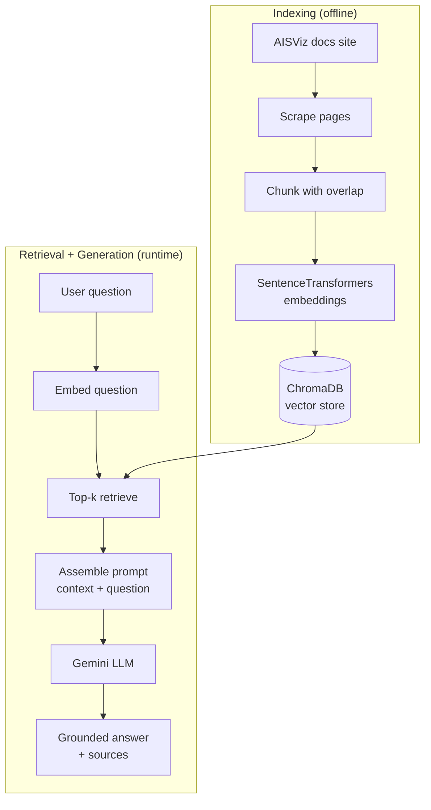

# Building a RAG Chatbot

A raw language model asked about AISdb will confidently invent function names that were never in the library. In this tutorial you build a chatbot that cannot do that, because every answer is generated from passages retrieved out of the real AISViz documentation and each response reports the source pages it leaned on. The whole pipeline, scraper to web interface, runs locally on a laptop and drops onto a Hugging Face Space unchanged when you want a public URL.

## What you will learn

* Scrape live documentation sites into a clean text corpus
* Split long pages into overlapping chunks sized for retrieval
* Embed chunks with SentenceTransformers and store them in a ChromaDB vector store
* Retrieve top-k context per question and generate a grounded, source-citing Gemini answer
* Serve the chatbot through Gradio and publish it as a Hugging Face Space

## Prerequisites

```bash
pip install langchain "langchain[google-genai]" chromadb sentence-transformers gradio beautifulsoup4 requests
```

No AIS file is needed on this page. The corpus is the documentation itself, crawled live from [https://aisviz.gitbook.io/documentation](https://aisviz.gitbook.io/documentation) and [https://aisviz.cs.dal.ca](https://aisviz.cs.dal.ca) in step 1. You also need a Google AI Studio API key (any LangChain-supported provider works the same way), exported before you start.

```bash
export GOOGLE_API_KEY="your-api-key-here"
```

The pipeline has two phases. Indexing runs offline and turns the docs into a searchable vector store; retrieval and generation run at question time.



## 1. Scrape the documentation

The chatbot can only answer from pages it has seen, so the first step crawls both public sites, follows same-domain links, and keeps the main content block of every page along with its URL for later attribution.


```python
import time
import requests
from bs4 import BeautifulSoup
from urllib.parse import urljoin, urlparse

def scrape_aisviz_docs():
    """Crawl the AISViz docs and return dicts of url, title, and content."""
    base_urls = [
        "https://aisviz.gitbook.io/documentation",
        "https://aisviz.cs.dal.ca",
    ]
    scraped, visited = [], set()

    def grab(url):
        response = requests.get(url, timeout=30)
        soup = BeautifulSoup(response.content, "html.parser")
        main = soup.find("div", class_="page-content") or soup.find("main")
        if main:
            title = soup.find("title")
            scraped.append({
                "url": url,
                "title": title.get_text() if title else "AISViz Documentation",
                "content": main.get_text(strip=True),
            })
        return soup

    for base_url in base_urls:
        soup = grab(base_url)
        for link in soup.find_all("a", href=True):
            full_url = urljoin(base_url, link["href"])
            same_site = urlparse(full_url).netloc == urlparse(base_url).netloc
            if not same_site or full_url in visited:
                continue
            visited.add(full_url)
            try:
                time.sleep(0.5)          # be polite to the server
                grab(full_url)
            except Exception as e:
                print(f"error scraping {full_url}: {e}")

    return scraped

docs_data = scrape_aisviz_docs()
print(f"scraped {len(docs_data)} pages")
```


The page count moves as the documentation grows, and answers are only ever as current as the last crawl, so re-run this step whenever pages change.

## 2. Split pages into chunks

Whole pages are too long to retrieve precisely and would not fit a prompt anyway. Splitting into roughly 1000-character chunks with 200 characters of overlap keeps each chunk focused while the overlap stops sentences from being cut mid-thought at chunk borders.


```python
def split_text(text, chunk_size=1000, chunk_overlap=200):
    """Split text into overlapping chunks, breaking at natural boundaries."""
    chunks, start = [], 0
    while start < len(text):
        end = start + chunk_size
        if end < len(text):               # prefer a sentence or word boundary
            for boundary in ('.', '\n', ' '):
                cut = text.rfind(boundary, start, end)
                if cut > start + chunk_size // 2:
                    end = cut + 1
                    break
        chunk = text[start:end].strip()
        if chunk:
            chunks.append(chunk)
        start = end - chunk_overlap if end < len(text) else end
    return chunks

all_chunks, chunk_metadata = [], []
for doc in docs_data:
    for i, chunk in enumerate(split_text(doc["content"])):
        all_chunks.append(chunk)
        chunk_metadata.append(
            {"source": doc["url"], "title": doc["title"], "chunk_id": i}
        )

print(f"split documentation into {len(all_chunks)} chunks")
```


## 3. Embed and store in ChromaDB

Retrieval works by comparing vectors, so every chunk gets encoded once with the compact `all-MiniLM-L6-v2` SentenceTransformer and written into a persistent Chroma collection. The `./chroma_db` directory survives restarts, which means you index once and query many times.


```python
import chromadb
from sentence_transformers import SentenceTransformer

embeddings_model = SentenceTransformer("all-MiniLM-L6-v2")
chroma_client = chromadb.PersistentClient(path="./chroma_db")
collection = chroma_client.get_or_create_collection(name="aisviz_docs")

chunk_embeddings = embeddings_model.encode(all_chunks, show_progress_bar=True)
collection.add(
    embeddings=chunk_embeddings.tolist(),
    documents=all_chunks,
    metadatas=chunk_metadata,
    ids=[f"chunk_{i}" for i in range(len(all_chunks))],
)
print("documents indexed and stored in Chroma")
```


## 4. Retrieve context and generate answers

At question time the pipeline embeds the question with the same model, pulls the four most similar chunks from Chroma, and hands them to Gemini with instructions to answer only from that context and to say so when the context does not contain the answer. That last instruction is what keeps the bot from inventing APIs.


```python
import getpass
import os

from langchain.chat_models import init_chat_model

if not os.environ.get("GOOGLE_API_KEY"):
    os.environ["GOOGLE_API_KEY"] = getpass.getpass("Enter API key for Google Gemini: ")

model = init_chat_model("gemini-2.5-flash", model_provider="google_genai")

SYSTEM_PROMPT = (
    "You are an assistant for question-answering tasks about AISViz documentation "
    "and maritime vessel tracking. Use the retrieved context to answer the question. "
    "If you don't know the answer based on the context, say that you don't know. "
    "Keep the answer concise and mention which sources you are referencing."
)

def answer_question(question, k=4):
    """Answer a question from the indexed AISViz documentation."""
    question_embedding = embeddings_model.encode([question])
    results = collection.query(
        query_embeddings=question_embedding.tolist(), n_results=k
    )

    docs = results["documents"][0]
    metas = results["metadatas"][0]
    context = "\n\n".join(
        f"Source: {meta.get('title', 'AISViz Documentation')}\n{doc}"
        for doc, meta in zip(docs, metas)
    )

    prompt = f"{SYSTEM_PROMPT}\n\nContext:\n{context}\n\nQuestion: {question}\n\nAnswer:"
    response = model.invoke(prompt)
    return {
        "answer": response.content,
        "sources": [meta.get("source", "") for meta in metas],
    }

result = answer_question("What is AISViz?")
print("Answer:", result["answer"])
print("Sources:", result["sources"])
```


## 5. Serve it with Gradio

A chat window makes the bot usable by people who will never open the script. Gradio's `ChatInterface` wraps `answer_question` in a few lines and appends the retrieved sources to every reply so users can verify claims themselves.


```python
import gradio as gr

def chatbot_interface(message, history):
    result = answer_question(message)
    response = result["answer"]
    unique_sources = list(set(result["sources"][:3]))
    if unique_sources:
        response += "\n\n**Sources:**\n" + "\n".join(f"- {s}" for s in unique_sources)
    return response

demo = gr.ChatInterface(
    fn=chatbot_interface,
    title="AISViz Documentation Chatbot",
    description="Ask questions about AISViz, AISdb, and maritime vessel tracking.",
    examples=[
        "What is AISViz?",
        "How do I get started with AISdb?",
        "How can I analyze vessel trajectories?",
    ],
)

if __name__ == "__main__":
    demo.launch()
```


`demo.launch()` starts the app on a local URL, usually `http://127.0.0.1:7860`, and it comes up in under a minute once the index is built.

## 6. Publish as a Hugging Face Space

The same script becomes a public chatbot with no code changes. Create a Space, upload the file as `app.py`, list the packages from Prerequisites in a `requirements.txt`, and add `GOOGLE_API_KEY` as a Space secret. The Space runs the identical code you tested locally, so there is nothing new to debug; the full workflow is in the [Hugging Face Spaces documentation](https://huggingface.co/docs/hub/spaces).

## Results

A run against a freshly indexed docs collection answers the test question like this.

```
Answer: AISViz is a platform for collecting, storing, and analyzing AIS
(Automatic Identification System) vessel tracking data. AISdb is the Python
package that powers it, giving you tools to decode raw AIS messages, query
them from SQLite or PostgreSQL, and build vessel tracks for analysis. It's
built for researchers working with maritime traffic and marine spatial data.
Sources: ['https://aisviz.gitbook.io/documentation', 'https://aisviz.cs.dal.ca']
```

The wording and the exact sources depend on which pages you indexed and which Gemini version answers, so expect the substance rather than the bytes to match. If an answer comes back thin or wrong, open the cited source page, it is usually the page that needs improving, then re-crawl and re-index.

## Takeaway

* Grounding a model in retrieved documentation replaces invented function names with answers that cite real pages.
* The index is a snapshot. Re-run the scrape-chunk-embed steps whenever the docs change, or the bot answers from stale text.
* Chunk size and overlap trade retrieval precision against context. The 1000/200 defaults work well for documentation prose.
* A hosted model still sounds confident on thin context, which is why every response carries its sources for checking.

Next, [A No-Code Interface](a-no-code-interface.md) wraps AISdb preprocessing and a similar chat assistant in a point-and-click Gradio app.

## References

* [LangChain documentation](https://python.langchain.com/docs/introduction/)
* [ChromaDB documentation](https://docs.trychroma.com/)
* [Sentence-Transformers documentation](https://www.sbert.net/)
* [Google AI Studio (Gemini API keys)](https://aistudio.google.com/)
* [Gradio documentation](https://www.gradio.app/docs/)
