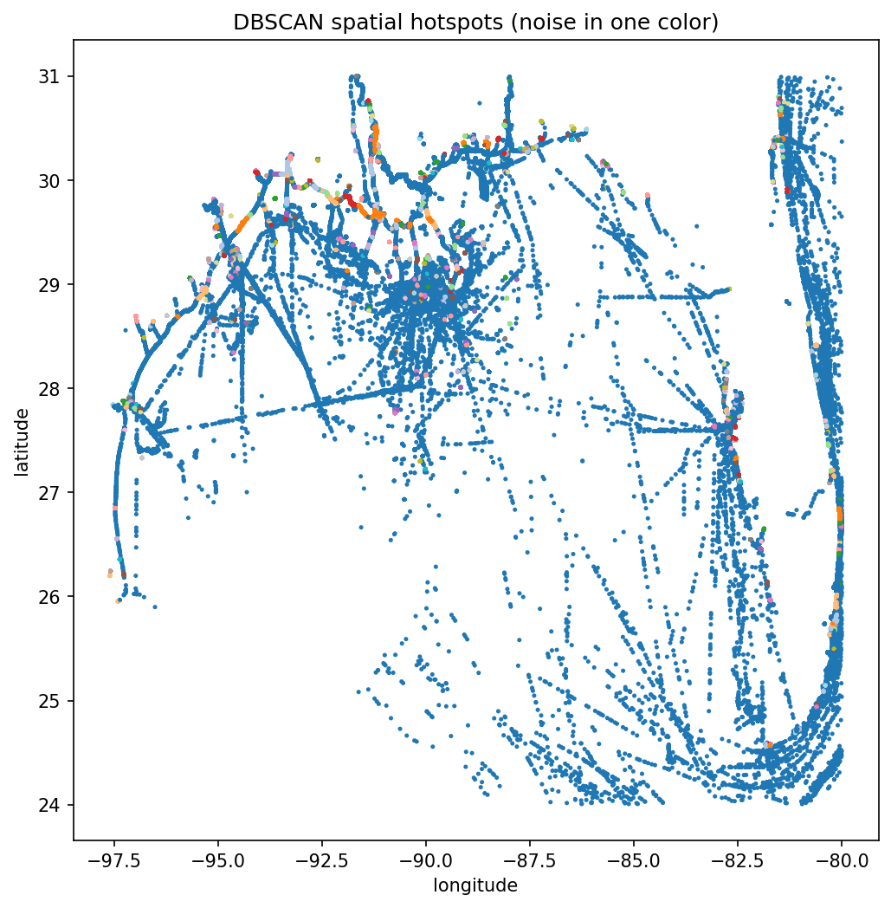
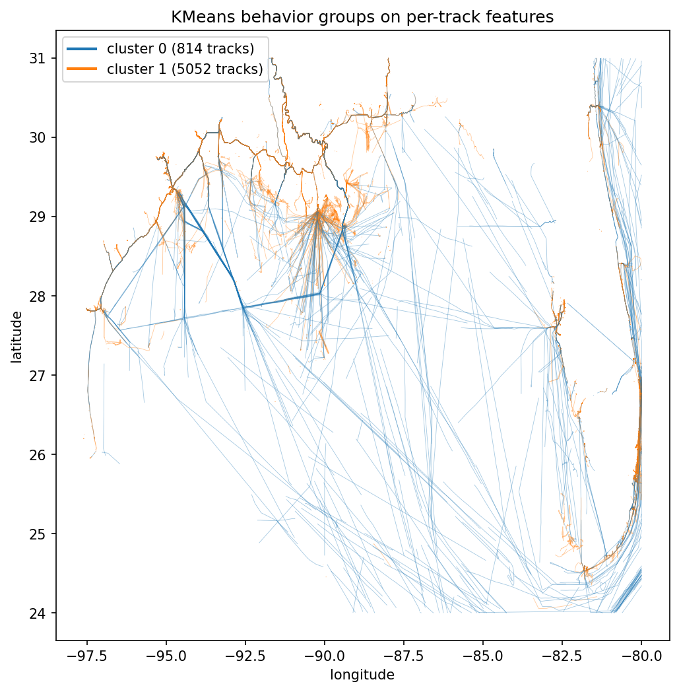

# Clustering with Scikit Learn

AIS gives you millions of position reports, but a raw stream of latitude and longitude says little on its own. In this tutorial you build two clustering pipelines on one open day of NOAA data over the Gulf of Mexico. DBSCAN pools every position to surface ports, anchorages, and fairways as dense hotspots, and KMeans groups whole tracks by movement features to separate vessels underway from vessels that barely move, the same machinery anomaly detection starts from.

## What you will learn

* Decode a NOAA day file into SQLite and pull vessel tracks with AISdb
* Run DBSCAN with a haversine metric so `eps` means kilometers, not degrees
* Reduce each track to a six-value movement feature vector with `delta_knots`
* Choose the KMeans cluster count with a silhouette sweep and read the cluster profiles

## Prerequisites

```bash
pip install aisdb scikit-learn matplotlib
```

One data file, the open NOAA day [`AIS_2020_01_01.zip`](https://coast.noaa.gov/htdata/CMSP/AISDataHandler/2020/AIS_2020_01_01.zip), decoded via `aisdb.decode_msgs` in step 1. Every number and figure below is the output of running this page end to end on AISdb 1.8.0-alpha.

## 1. Decode the day file and generate tracks

`decode_msgs` accepts the compressed archive directly, so one call covers download to database, and the decode is a one-time cost (this run chewed through seven million messages on a heavily loaded shared server). The query window covers the Gulf of Mexico, a busy mix of port calls, offshore-supply runs, and through traffic, and `TrackGen` yields one dictionary per vessel with aligned `lon`, `lat`, `time`, and `sog` arrays, materialized with `list(...)` because both pipelines iterate the tracks twice.


```python
import urllib.request
from datetime import datetime
from pathlib import Path

import numpy as np
import aisdb
from aisdb import SQLiteDBConn, DBQuery
from aisdb.database import sqlfcn_callbacks
from aisdb.gis import delta_knots

Path('./data').mkdir(exist_ok=True)
zip_path = Path('./data/AIS_2020_01_01.zip')
dbpath = './data/ais_2020_01_01.db'
url = 'https://coast.noaa.gov/htdata/CMSP/AISDataHandler/2020/AIS_2020_01_01.zip'
if not zip_path.exists():
    urllib.request.urlretrieve(url, zip_path)

if not Path(dbpath).exists():
    with SQLiteDBConn(dbpath=dbpath) as dbconn:
        aisdb.decode_msgs(filepaths=[str(zip_path)], dbconn=dbconn,
                          source='NOAA', verbose=True)

with SQLiteDBConn(dbpath=dbpath) as dbconn:
    qry = DBQuery(dbconn=dbconn,
                  start=datetime(2020, 1, 1), end=datetime(2020, 1, 2),
                  xmin=-98, xmax=-80, ymin=24, ymax=31,  # Gulf of Mexico
                  callback=sqlfcn_callbacks.in_bbox_time_validmmsi)
    tracks = list(aisdb.track_gen.TrackGen(qry.gen_qry(), decimate=False))

n_positions = sum(len(t['time']) for t in tracks)
print(f"loaded {len(tracks)} vessel tracks ({n_positions:,} positions)")
```


```
AIS_2020_01_01.csv    count: 7040389    elapsed: 2297.13s    rate: 3065 msgs/s
loaded 5976 vessel tracks (3,080,231 positions)
```

## 2. Find spatial hotspots with DBSCAN

DBSCAN needs no cluster count up front, finds arbitrarily shaped dense regions, and labels sparse points as noise instead of forcing them into a group. The detail that trips people up is the metric. `haversine` expects radians, so `eps` is also in radians, and a 1 km neighborhood becomes `1 / 6371` (Earth's mean radius in km). A seeded 200,000-point subsample keeps the ball-tree search fast and exactly reproducible.


```python
from sklearn.cluster import DBSCAN

coords = np.concatenate([np.column_stack([t['lat'], t['lon']]) for t in tracks])

rng = np.random.default_rng(42)              # reproducible subsample
if coords.shape[0] > 200_000:
    coords = coords[rng.choice(coords.shape[0], size=200_000, replace=False)]

eps_km = 1.0                                 # neighborhood radius
db = DBSCAN(eps=eps_km / 6371.0, min_samples=25,
            metric='haversine', algorithm='ball_tree',
            ).fit(np.radians(coords))

labels = db.labels_
n_clusters = len(set(labels)) - (1 if -1 in labels else 0)
print(f"{n_clusters} spatial hotspots, {int(np.sum(labels == -1))} noise points")
```


```
555 spatial hotspots, 26630 noise points
```

Both parameters have physical meaning, kilometers and a point count, so you can reason about them instead of guessing. The noise points are mostly vessels in open transit whose positions never pile up densely enough to anchor a cluster.

## 3. Build per-track movement features

Hotspots tell you where things happen, not how vessels behave. For behavior, reduce each track to a small vector, speed statistics, bounding-box extent, duration, and message count. The 80-knot sanity filter drops tracks with GPS teleports, which would otherwise blow up the speed features.


```python
MAX_PLAUSIBLE_KN = 80.0                      # faster segments are GPS jumps

def track_features(track):
    """One fixed-length movement feature vector per track."""
    speeds = delta_knots(track)              # n-1 speeds in knots
    if speeds.size == 0 or speeds.max() > MAX_PLAUSIBLE_KN:
        return None
    times = np.asarray(track['time'], dtype=float)
    return np.array([
        np.mean(speeds),                     # mean speed (knots)
        np.median(speeds),                   # median speed, spike-robust
        track['lat'].max() - track['lat'].min(),  # N-S extent (degrees)
        track['lon'].max() - track['lon'].min(),  # E-W extent (degrees)
        (times[-1] - times[0]) / 3600.0,     # duration (hours)
        float(times.size),                   # message count
    ])

valid = [(t, f) for t in tracks if (f := track_features(t)) is not None]
tracks_kept = [t for t, _ in valid]
X = np.vstack([f for _, f in valid])
print(f"feature matrix: {X.shape[0]} tracks x {X.shape[1]} features")
print(f"dropped {len(tracks) - X.shape[0]} tracks failing the 80 kn sanity check")
```


```
feature matrix: 5866 tracks x 6 features
dropped 110 tracks failing the 80 kn sanity check
```

## 4. Sweep k, fit KMeans, read the profiles

Standardize the columns first, KMeans measures Euclidean distance and the message count would otherwise dominate the knots. Then sweep k and keep the silhouette winner, which rewards clusters that are tight internally and well separated, and print each cluster's feature means to see what it represents.


```python
from sklearn.preprocessing import StandardScaler
from sklearn.cluster import KMeans
from sklearn.metrics import silhouette_score

X_scaled = StandardScaler().fit_transform(X)

best_k, best_score, best_model = None, -1.0, None
for k in range(2, 9):
    model = KMeans(n_clusters=k, n_init=10, random_state=42)
    score = silhouette_score(X_scaled, model.fit_predict(X_scaled))
    print(f"k={k}: silhouette={score:.3f}")
    if score > best_score:
        best_k, best_score, best_model = k, score, model

print(f"best k = {best_k} (silhouette {best_score:.3f})")
labels_km = best_model.labels_

feature_names = ['mean_kn', 'median_kn', 'lat_ext', 'lon_ext', 'dur_hr', 'n_msg']
for c in range(best_k):
    members = X[labels_km == c]
    profile = dict(zip(feature_names, members.mean(axis=0).round(2).tolist()))
    print(f"cluster {c}: {members.shape[0]} tracks -> {profile}")
```


```
k=2: silhouette=0.580
k=3: silhouette=0.512
k=4: silhouette=0.481
k=5: silhouette=0.493
k=6: silhouette=0.533
k=7: silhouette=0.540
k=8: silhouette=0.546
best k = 2 (silhouette 0.580)
cluster 0: 814 tracks -> {'mean_kn': 8.76, 'median_kn': 9.27, 'lat_ext': 0.87, 'lon_ext': 1.07, 'dur_hr': 14.14, 'n_msg': 386.64}
cluster 1: 5052 tracks -> {'mean_kn': 0.89, 'median_kn': 0.41, 'lat_ext': 0.08, 'lon_ext': 0.1, 'dur_hr': 21.44, 'n_msg': 544.52}
```

The score peaks at k=2 and never recovers, so the dominant structure in a port-heavy day is binary. The profiles read it off directly, cluster 0 is 814 underway transits at about nine knots sweeping roughly a degree of latitude and longitude, cluster 1 is 5052 moored and anchored tracks averaging under a knot across a tenth of a degree.

## Results


```python
import matplotlib.pyplot as plt

plt.figure(figsize=(8, 8))
plt.scatter(coords[:, 1], coords[:, 0], c=labels, s=2, cmap='tab20')
plt.xlabel('longitude'); plt.ylabel('latitude')
plt.title('DBSCAN spatial hotspots (noise in one color)')
plt.show()

plt.figure(figsize=(8, 8))
for t, c in zip(tracks_kept, labels_km):
    plt.plot(t['lon'], t['lat'], color=f'C{c}', linewidth=0.4, alpha=0.4)
handles = [plt.Line2D([0], [0], color=f'C{c}', linewidth=2,
                      label=f'cluster {c} ({int(np.sum(labels_km == c))} tracks)')
           for c in range(best_k)]
plt.legend(handles=handles, loc='upper left')
plt.xlabel('longitude'); plt.ylabel('latitude')
plt.title('KMeans behavior groups on per-track features')
plt.show()
```


<figure><figcaption>DBSCAN hotspots over the Gulf of Mexico, one NOAA day subsampled to 200,000 positions. The 26,630 noise points render in one color and trace the offshore fairways; the 555 dense clusters (eps 1 km, min_samples 25) pile up along the coast at ports, anchorages, and platforms.</figcaption></figure>

<figure><figcaption>KMeans behavior groups, same day and region. The silhouette sweep selects k=2, splitting 814 underway transits (blue) whose paths trace the lanes across the Gulf from 5052 near-stationary moored and anchored tracks (orange) hugging the ports and coast.</figcaption></figure>

The two-cluster answer is real but coarse. One day of port-heavy AIS is overwhelmingly stationary vessels, so the strongest available signal is moving versus not moving; a longer window plus features like heading variance and turning rate is what separates transit types and fishing patterns. Run tracks through the denoising in [Data Cleaning](../tutorials/data-cleaning.md) first when precision matters, and treat any unsupervised result as a hypothesis to validate against charts and domain knowledge.

## Takeaway

* DBSCAN with a haversine metric finds ports, anchorages, and fairways with parameters you can reason about in kilometers and point counts.
* Six movement features per track plus standardization is enough for KMeans to separate underway traffic from moored vessels.
* The silhouette sweep turns "how many clusters" from a guess into a defensible choice, but sanity-check that the winner is interpretable.
* Subsample pooled positions with a seeded generator; haversine DBSCAN over millions of raw points is slow and memory hungry.

Next, [Kalman Filters with FilterPy](kalman-filters-with-filterpy.md) models how a single track evolves through time and smooths its noise away.

## References

* scikit-learn clustering user guide: [https://scikit-learn.org/stable/modules/clustering.html](https://scikit-learn.org/stable/modules/clustering.html)
* AISdb repository: [https://github.com/MAPS-Lab/AISdb](https://github.com/MAPS-Lab/AISdb)
