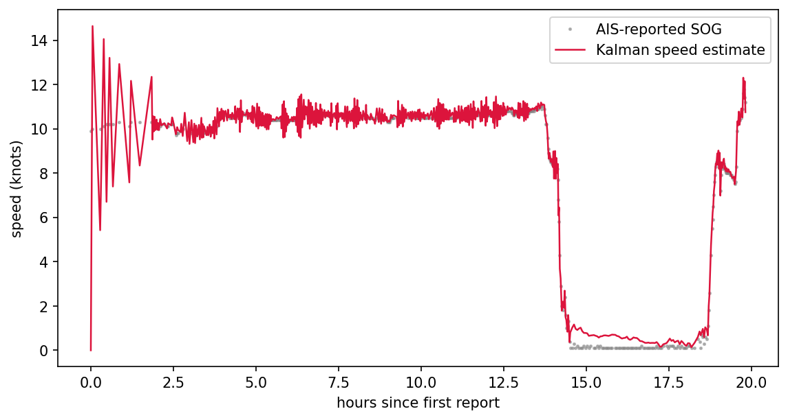
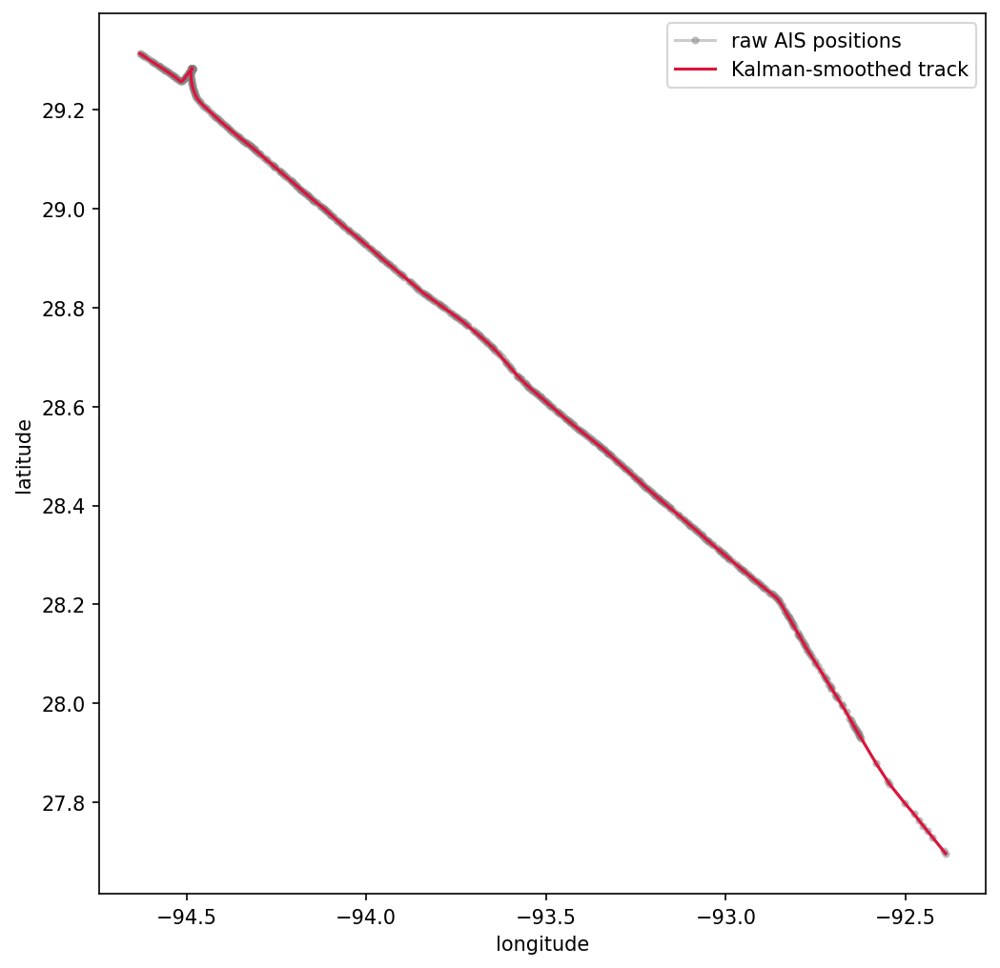

# Kalman Filters with FilterPy

Raw AIS positions jitter, drop out, and arrive on an uneven clock, so a plotted track shows saw-tooth zig-zags no vessel ever sailed. In this tutorial you build a constant-velocity Kalman filter with [FilterPy](https://filterpy.readthedocs.io/), run it over a real NOAA track pulled through AISdb, and get back a smoothed path, a speed estimate at every report, and a statistical test that flags spurious GPS fixes before they reach a chart or a downstream model.

## What you will learn

* Select a steady transit out of thousands of tracks using `delta_knots`
* Set up a four-state constant-velocity filter and read `H`, `R`, `P`, `F`, and `Q`
* Handle AIS's irregular reporting clock by rebuilding `F` and `Q` from each time gap
* Flag GPS outliers with the filter's innovation instead of hand-tuned distance rules

## Prerequisites

```bash
pip install aisdb filterpy matplotlib
```

One data file, the open NOAA day [`AIS_2020_01_01.zip`](https://coast.noaa.gov/htdata/CMSP/AISDataHandler/2020/AIS_2020_01_01.zip), decoded to `./data/ais_2020_01_01.db` via `aisdb.decode_msgs` exactly as in step 1 of the [clustering tutorial](clustering-with-scikit-learn.md). Every number and figure below is the output of running this page end to end on AISdb 1.8.0-alpha.

## 1. Query the day and generate tracks

With the database in place, query the Gulf of Mexico window. `decimate=False` matters here, curve decimation would throw away exactly the irregular spacing the filter is designed to handle.


```python
from datetime import datetime

import numpy as np
import aisdb
from aisdb import SQLiteDBConn, DBQuery
from aisdb.database import sqlfcn_callbacks
from aisdb.gis import delta_knots

dbpath = './data/ais_2020_01_01.db'  # built in the clustering tutorial

with SQLiteDBConn(dbpath=dbpath) as dbconn:
    qry = DBQuery(dbconn=dbconn,
                  start=datetime(2020, 1, 1), end=datetime(2020, 1, 2),
                  xmin=-98, xmax=-80, ymin=24, ymax=31,  # Gulf of Mexico
                  callback=sqlfcn_callbacks.in_bbox_time_validmmsi)
    tracks = list(aisdb.track_gen.TrackGen(qry.gen_qry(), decimate=False))

n_positions = sum(t['time'].size for t in tracks)
print(f"loaded {len(tracks)} vessel tracks ({n_positions:,} positions)")
```


```
loaded 5976 vessel tracks (3,080,231 positions)
```

## 2. Pick one steady vessel

A constant-velocity model is easiest to read on a vessel that holds a course, so keep only genuine transits, 150 to 600 reports, no inter-report speed above 60 knots (GPS teleports), a median speed of 8 to 18 knots (cruising pace, not drifting or docked), at least 5 hours long, and take the longest survivor. `delta_knots` doubles as the teleport check (its maximum) and the cruising check (its median).


```python
def steady(t):
    if not (150 <= t['time'].size <= 600):
        return False
    speeds = delta_knots(t)
    return (speeds.size > 0 and np.max(speeds) <= 60
            and 8 <= np.median(speeds) <= 18
            and (t['time'][-1] - t['time'][0]) / 3600 >= 5)

candidates = [t for t in tracks if steady(t)]
track = max(candidates, key=lambda t: t['time'].size)
print(f"{len(candidates)} candidates")
print(f"selected MMSI {track['mmsi']} with {track['time'].size} reports")
```


```
141 candidates
selected MMSI 538090531 with 597 reports
```

## 3. Build the constant-velocity filter

The state is `[x, y, vx, vy]` in local meters (an equirectangular projection is accurate over one track's extent, and meters keep velocity physical). `H` picks position out of the state because AIS observes position, not velocity; `R` encodes trust in each fix; `P` starts wide on velocity because it is initialized at zero with no evidence yet. Since reports arrive on an uneven clock, `F` and `Q` are functions of each elapsed gap rather than fixed matrices, with `Q` growing in the gap because a longer blind stretch leaves more room for the vessel to have turned.


```python
from filterpy.kalman import KalmanFilter
from filterpy.common import Q_discrete_white_noise

lat0, lon0 = np.mean(track['lat']), np.mean(track['lon'])
meters_per_deg_lat = 111_320.0
meters_per_deg_lon = 111_320.0 * np.cos(np.radians(lat0))

x_m = (track['lon'] - lon0) * meters_per_deg_lon
y_m = (track['lat'] - lat0) * meters_per_deg_lat
t_s = track['time'].astype(float)

kf = KalmanFilter(dim_x=4, dim_z=2)
kf.x = np.array([x_m[0], y_m[0], 0.0, 0.0])   # first position, zero velocity
kf.P = np.diag([25.0, 25.0, 100.0, 100.0])    # unsure about velocity
kf.H = np.array([[1, 0, 0, 0],                # we observe position only,
                 [0, 1, 0, 0]])               # never velocity
gps_std = 15.0                                # terrestrial AIS position spread
kf.R = np.eye(2) * gps_std ** 2

def transition_matrix(dt):
    return np.array([[1, 0, dt, 0], [0, 1, 0, dt],
                     [0, 0, 1, 0], [0, 0, 0, 1]])

def process_noise(dt, accel_std=0.1):
    q1d = Q_discrete_white_noise(dim=2, dt=dt, var=accel_std ** 2)
    Q = np.zeros((4, 4))
    Q[0::2, 0::2] = q1d  # x, vx block
    Q[1::2, 1::2] = q1d  # y, vy block
    return Q
```


`accel_std` is the one knob worth tuning, expected velocity change in meters per second squared. A steady cargo-style transit earns `0.1`, letting the filter smooth through jitter; a maneuvering tug or fishing vessel needs closer to `0.5` so it does not fight real turns.

## 4. Run the filter over the track

Loop through the reports in order, predict forward by the elapsed gap, update with the new fix, and record the state. Speed comes from the velocity components, and the inverse projection puts the smoothed path back into degrees for mapping.


```python
smoothed_x, smoothed_y = [x_m[0]], [y_m[0]]
smoothed_vx, smoothed_vy = [0.0], [0.0]
smoothed_t = [t_s[0]]

for i in range(1, len(t_s)):
    dt = float(t_s[i] - t_s[i - 1])
    if dt <= 0:
        continue                 # skip duplicate or out-of-order timestamps
    kf.F = transition_matrix(dt)
    kf.Q = process_noise(dt)
    kf.predict()
    kf.update(np.array([x_m[i], y_m[i]]))
    smoothed_x.append(kf.x[0])
    smoothed_y.append(kf.x[1])
    smoothed_vx.append(kf.x[2])
    smoothed_vy.append(kf.x[3])
    smoothed_t.append(t_s[i])

smoothed_x, smoothed_y = np.array(smoothed_x), np.array(smoothed_y)
smoothed_t = np.array(smoothed_t)
speed_knots = np.hypot(smoothed_vx, smoothed_vy) * 1.9438

smoothed_lon = smoothed_x / meters_per_deg_lon + lon0
smoothed_lat = smoothed_y / meters_per_deg_lat + lat0
```


## 5. Flag GPS outliers with the innovation

The innovation is the gap between a measurement and the filter's prediction, judged against the uncertainty the filter already computed. A fix landing more than four sigma out is exactly the spurious jump denoising code hunts for, so reset the filter and make a second pass that tests each fix before accepting it.


```python
flagged = []
kf.x = np.array([x_m[0], y_m[0], 0.0, 0.0])
kf.P = np.diag([25.0, 25.0, 100.0, 100.0])

for i in range(1, len(t_s)):
    dt = float(t_s[i] - t_s[i - 1])
    if dt <= 0:
        continue
    kf.F = transition_matrix(dt)
    kf.Q = process_noise(dt)
    kf.predict()

    innovation = np.array([x_m[i], y_m[i]]) - kf.H @ kf.x
    innovation_std = np.sqrt(np.diag(kf.H @ kf.P @ kf.H.T + kf.R))
    if np.any(np.abs(innovation) > 4 * innovation_std):
        flagged.append(i)

    kf.update(np.array([x_m[i], y_m[i]]))

print(f"{len(flagged)} of {len(t_s)} reports flagged as likely GPS outliers")
```


```
0 of 597 reports flagged as likely GPS outliers
```

Zero flags is the right answer here, not a bug, this vessel was selected for its steadiness. Run the identical pass over the day's loitering vessels and the flags land where they should. A stationary vessel with a 41-knot teleport in an otherwise clean track flagged 3 of 405 reports, and a corrupted transceiver whose fixes jump at up to 1352 knots flagged 153 of 646. Four sigma is conservative on purpose; tighten it to catch subtler drift at the cost of false positives on legitimate sharp turns.

## Results


```python
import matplotlib.pyplot as plt

plt.figure(figsize=(9, 4.5))
plt.plot((t_s - t_s[0]) / 3600, track['sog'], '.', color='gray',
         markersize=3, alpha=0.5, label='AIS-reported SOG')
plt.plot((smoothed_t - t_s[0]) / 3600, speed_knots, '-', color='crimson',
         linewidth=1.2, label='Kalman speed estimate')
plt.xlabel('hours since first report'); plt.ylabel('speed (knots)')
plt.legend(); plt.show()

plt.figure(figsize=(8, 8))
plt.plot(track['lon'], track['lat'], 'o-', color='gray', alpha=0.4,
         markersize=3, label='raw AIS positions')
plt.plot(smoothed_lon, smoothed_lat, '-', color='crimson', linewidth=1.5,
         label='Kalman-smoothed track')
plt.xlabel('longitude'); plt.ylabel('latitude')
plt.legend(); plt.show()
```


<figure><figcaption>Kalman speed estimate against the AIS-reported SOG for MMSI 538090531. After the spin-up the estimate locks onto the ~10.5 knot cruise, follows the drop to a four-hour stop around hour 14, and picks the vessel back up as it gets underway again near hour 19.</figcaption></figure>

The ringing over the first two hours looks alarming and is not. The state begins with `vx = vy = 0`, so the earliest steps show the filter swinging toward the true speed as evidence arrives; seed the initial velocity from the first two positions if you need a clean series from the first sample. From then on the estimate and the vessel's own SOG track each other closely, including through the stop, where the estimate floors near half a knot because anchored GPS jitter never quite reads as zero motion.

<figure><figcaption>Raw AIS positions versus the Kalman-smoothed track for MMSI 538090531, a 200 km transit across the Gulf on 2020-01-01. At basin scale the smoothed line sits on top of the raw fixes; the hook at the northwest end is the anchoring stop, where the filter rounds the swing instead of chasing every jittered fix.</figcaption></figure>

The two lines separate exactly where they should, at tight maneuvers, long reporting gaps, and any fix that reads far from its neighbors. Remember the filter smooths noise but not bias, a transceiver reporting a consistently offset position produces a faithfully smoothed offset track, so cross-check persistent lane divergences against other data.

## Takeaway

* A constant-velocity Kalman filter turns jittery, unevenly timed AIS reports into a smooth track plus a velocity estimate at every step.
* Rebuilding `F` and `Q` from each report gap is what makes the filter native to AIS's irregular clock.
* `accel_std` is the single knob that trades smoothness against responsiveness; match it to the vessel's maneuvering style.
* The innovation test gives a principled GPS-outlier flag for free, no hand-tuned distance thresholds required.

Next, [seq2seq in PyTorch](seq2seq-in-pytorch.md) learns to predict where a denoised, velocity-bearing track goes next.

## References

* FilterPy documentation: [https://filterpy.readthedocs.io/](https://filterpy.readthedocs.io/)
* Roger Labbe, "Kalman and Bayesian Filters in Python": [https://github.com/rlabbe/Kalman-and-Bayesian-Filters-in-Python](https://github.com/rlabbe/Kalman-and-Bayesian-Filters-in-Python)
* AISdb repository: [https://github.com/MAPS-Lab/AISdb](https://github.com/MAPS-Lab/AISdb)
