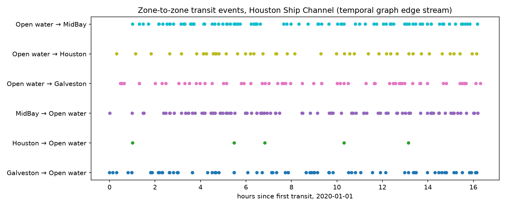
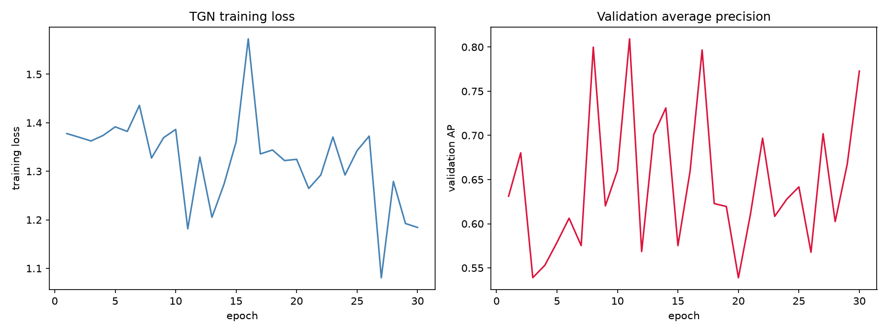

# TGNs with TorchGeometric

Maritime traffic is relational. A port is busy because ships arrive from many origins, and a strait is congested because dozens of routes funnel through it. This tutorial turns one day of open NOAA AIS data into a stream of timestamped zone-to-zone transits with AISdb, then trains a Temporal Graph Network (TGN) in PyTorch Geometric to predict which transit happens next. You walk away able to convert raw AIS into a `TemporalData` event stream and run an event-driven link-prediction loop on it.

## What you will learn

* Building zone-to-zone transit edges from raw AIS with `aisdb.network_graph.graph`
* Loading a transit CSV into a PyTorch Geometric `TemporalData` event stream
* Assembling a TGN from `TGNMemory`, an attention embedding, and a link predictor
* Training and evaluating future-link prediction on chronological splits

## Prerequisites

```bash
pip install aisdb torch torch-geometric scikit-learn pandas
```

Every number and figure on this page comes from one open dataset, the NOAA AIS day file for 2020-01-01 (about 200 MB zipped, from [coast.noaa.gov](https://coast.noaa.gov/htdata/CMSP/AISDataHandler/2020/AIS_2020_01_01.zip)), so anyone with AISdb installed can reproduce the whole run.

## Step 1. Decode the NOAA day file

Decode the zipped archive straight into SQLite, then query the Gulf of Mexico window and vectorize the rows into per-vessel tracks. One day keeps the download small and is enough to see the pipeline work end to end.

```python
from datetime import datetime

from aisdb import DBQuery, SQLiteDBConn, TrackGen, decode_msgs
from aisdb.database import sqlfcn_callbacks

DB_PATH = "./noaa_20200101.db"
ZIP_PATH = "./AIS_2020_01_01.zip"

with SQLiteDBConn(dbpath=DB_PATH) as dbconn:
    decode_msgs(filepaths=[ZIP_PATH], dbconn=dbconn, source="NOAA", verbose=True)
    qry = DBQuery(
        dbconn=dbconn,
        start=datetime(2020, 1, 1), end=datetime(2020, 1, 2),
        xmin=-98, xmax=-80, ymin=24, ymax=31,
        callback=sqlfcn_callbacks.in_bbox_time_validmmsi,
    )
    tracks = list(TrackGen(qry.gen_qry(), decimate=False))

print(len(tracks), "vessel tracks")
```

```
5726 vessel tracks (1,944,019 positions)
```

## Step 2. Build the transit graph

The nodes come from a `DomainFromPoints`, three zones a few kilometers apart along the Houston Ship Channel, spaced so a single day of data actually contains same-day transits between them. Two AISdb behaviors matter here. `graph` derives each zone's integer id by stripping non-digits from its name, so every zone name must contain a number, and with a `SQLiteDBConn` the `trafficDBpath` argument must be a real string path (a fresh, empty SQLite file is fine). Passing `data_dir=None` skips the optional multi-gigabyte shore, port, and bathymetry rasters.

```python
from datetime import timedelta

from aisdb import DomainFromPoints, graph
from aisdb.database.sqlfcn_callbacks import in_bbox_time

TRAFFIC_DB = "./traffic.db"
EDGE_CSV = "./transit_graph.csv"

# Zone centers (lon, lat); each name embeds the numeric id graph() requires.
domain = DomainFromPoints(
    points=[(-95.02, 29.72), (-94.83, 29.53), (-94.70, 29.33)],
    radial_distances=[8000, 8000, 8000],
    names=["1_Houston", "2_MidBay", "3_Galveston"],
)

with SQLiteDBConn(dbpath=DB_PATH) as dbconn:
    qry = DBQuery(
        dbconn=dbconn,
        callback=in_bbox_time,
        start=datetime(2020, 1, 1), end=datetime(2020, 1, 2),
        **domain.boundary,
    )
    graph(
        qry,
        outputfile=EDGE_CSV,
        domain=domain,
        dbconn=dbconn,
        data_dir=None,               # skip the optional raster downloads
        trafficDBpath=TRAFFIC_DB,
        maxdelta=timedelta(hours=24),
        speed_threshold=50,
        distance_threshold=200000,
        interp_delta=timedelta(minutes=10),
        verbose=True,
    )
```

`graph` vectorizes the query, splits long gaps, denoises, geofences every track against the domain, and writes one CSV row per transit. Positions outside all zones are labeled `Z0`, an implicit open-water node that shows up as a genuine hub in the graph. We use `src_zone` and `rcv_zone` as endpoints, `last_seen_in_zone` as the event time, and `total_distance_meters`, `velocity_knots_avg`, and `minutes_spent_in_zone` as edge features. The final segment of every track has no onward transit, so AISdb writes its `rcv_zone` as the string `NULL` and we drop those rows.

## Step 3. Load the edges into TemporalData

`TemporalData` holds the event stream as parallel `src`, `dst`, `t`, and `msg` tensors. Two pandas details are load-bearing. `read_csv` turns the `NULL` string into `NaN`, so filter with `dropna`, and the minute-resolution timestamps parse to `datetime64[ms]`, which silently breaks the usual `.astype("int64") // 10**9` idiom, so convert through `pd.Timestamp.timestamp` instead. A chronological split holds out the last 30% of events so training never peeks at the future.

```python
import numpy as np
import pandas as pd
import torch
from torch_geometric.data import TemporalData

df = pd.read_csv(EDGE_CSV)

# Keep only true transits: both endpoints must be real zones.
df = df.dropna(subset=["rcv_zone"])
df = df[df["rcv_zone"].astype(str) != "NULL"].copy()
df["src_zone"] = df["src_zone"].astype(int)
df["rcv_zone"] = df["rcv_zone"].astype(int)

# Remap zone ids to contiguous node indices.
zone_ids = sorted(set(df["src_zone"]) | set(df["rcv_zone"]))
zone_to_idx = {z: i for i, z in enumerate(zone_ids)}
src = df["src_zone"].map(zone_to_idx).to_numpy()
dst = df["rcv_zone"].map(zone_to_idx).to_numpy()

# Event time in seconds since the epoch, safe at any datetime64 resolution.
parsed = pd.to_datetime(
    df["last_seen_in_zone"].str.replace(" UTC", "", regex=False),
    format="%Y-%m-%d %H:%M", utc=True,
)
t = parsed.map(pd.Timestamp.timestamp).astype("int64")

cols = ["total_distance_meters", "velocity_knots_avg", "minutes_spent_in_zone"]
msg = (df[[c for c in cols if c in df.columns]].replace("NULL", np.nan)
       .apply(pd.to_numeric, errors="coerce").fillna(0.0).to_numpy(dtype="float32"))
msg = (msg - msg.mean(0)) / (msg.std(0) + 1e-9)  # standardize features

order = np.argsort(t.to_numpy())
data = TemporalData(
    src=torch.as_tensor(src[order], dtype=torch.long),
    dst=torch.as_tensor(dst[order], dtype=torch.long),
    t=torch.as_tensor(t.to_numpy()[order], dtype=torch.long),
    msg=torch.as_tensor(msg[order], dtype=torch.float),
)
num_nodes = len(zone_ids)
print(data)

train_data, val_data, test_data = data.train_val_test_split(val_ratio=0.15, test_ratio=0.15)
```

On the NOAA day file this leaves 358 true transit events spanning 16.3 hours, over the three channel zones plus the `Z0` open-water node.

```
TemporalData(src=[358], dst=[358], t=[358], msg=[358, 3])
```

<figure><figcaption>The temporal graph edge stream, one point per zone-to-zone transit against time. Several transits touch the Z0 open-water node, which sits between the channel zones. NOAA Gulf of Mexico traffic, Houston Ship Channel, 2020-01-01.</figcaption></figure>

## Step 4. Define the TGN

A TGN (Rossi et al., 2020, [arXiv:2006.10637](https://arxiv.org/abs/2006.10637)) keeps a memory vector per node that summarizes every event the node has taken part in. Each new edge updates the memory of both endpoints, a `TransformerConv` embedding attends over recent neighbors while folding in the elapsed time since each interaction, and a small MLP scores candidate edges.

```python
from torch.nn import Linear
from torch_geometric.nn import TransformerConv
from torch_geometric.nn.models.tgn import (
    TGNMemory, IdentityMessage, LastAggregator, LastNeighborLoader,
)

device = torch.device("cuda" if torch.cuda.is_available() else "cpu")
memory_dim = time_dim = embedding_dim = 100
msg_dim = data.msg.size(-1)


class GraphAttentionEmbedding(torch.nn.Module):
    def __init__(self, in_channels, out_channels, msg_dim, time_enc):
        super().__init__()
        self.time_enc = time_enc
        edge_dim = msg_dim + time_enc.out_channels
        self.conv = TransformerConv(in_channels, out_channels // 2, heads=2,
                                    dropout=0.1, edge_dim=edge_dim)

    def forward(self, x, last_update, edge_index, t, msg):
        rel_t = last_update[edge_index[0]] - t
        edge_attr = torch.cat([self.time_enc(rel_t.to(x.dtype)), msg], dim=-1)
        return self.conv(x, edge_index, edge_attr)


class LinkPredictor(torch.nn.Module):
    def __init__(self, in_channels):
        super().__init__()
        self.lin_src = Linear(in_channels, in_channels)
        self.lin_dst = Linear(in_channels, in_channels)
        self.lin_final = Linear(in_channels, 1)

    def forward(self, z_src, z_dst):
        h = (self.lin_src(z_src) + self.lin_dst(z_dst)).relu()
        return self.lin_final(h)


torch.manual_seed(42)
memory = TGNMemory(
    num_nodes, msg_dim, memory_dim, time_dim,
    message_module=IdentityMessage(msg_dim, memory_dim, time_dim),
    aggregator_module=LastAggregator(),
).to(device)
gnn = GraphAttentionEmbedding(memory_dim, embedding_dim, msg_dim,
                              memory.time_enc).to(device)
link_pred = LinkPredictor(embedding_dim).to(device)
neighbor_loader = LastNeighborLoader(num_nodes, size=10, device=device)

optimizer = torch.optim.Adam(
    set(memory.parameters()) | set(gnn.parameters()) | set(link_pred.parameters()),
    lr=1e-3,
)
criterion = torch.nn.BCEWithLogitsLoss()
```

## Step 5. Train and evaluate

Future-link prediction trains as binary classification. For every real transit we sample one negative destination, push real scores up and fake scores down, replay events in time order, and reset the memory at the start of each epoch. Evaluation reuses the memory left behind by training and keeps replaying events chronologically, without gradients.

```python
from sklearn.metrics import average_precision_score
from torch_geometric.loader import TemporalDataLoader

train_loader = TemporalDataLoader(train_data, batch_size=32)
val_loader = TemporalDataLoader(val_data, batch_size=32)
test_loader = TemporalDataLoader(test_data, batch_size=32)

# Maps global node ids to the local index used inside a batch.
assoc = torch.empty(num_nodes, dtype=torch.long, device=device)


def run_batch(batch):
    """Score one chronological batch, returning positive and negative logits."""
    neg_dst = torch.randint(0, num_nodes, (batch.dst.size(0),),
                            dtype=torch.long, device=device)
    n_id = torch.cat([batch.src, batch.dst, neg_dst]).unique()
    neighbor_loader.insert(batch.src, batch.dst)
    n_id, edge_index, e_id = neighbor_loader(n_id)
    assoc[n_id] = torch.arange(n_id.size(0), device=device)
    z, last_update = memory(n_id)
    z = gnn(z, last_update, edge_index,
            data.t[e_id].to(device), data.msg[e_id].to(device))
    pos_out = link_pred(z[assoc[batch.src]], z[assoc[batch.dst]])
    neg_out = link_pred(z[assoc[batch.src]], z[assoc[neg_dst]])
    return pos_out, neg_out


def train():
    for m in (memory, gnn, link_pred):
        m.train()
    memory.reset_state()          # start each epoch with an empty memory
    neighbor_loader.reset_state()
    total_loss = 0.0
    for batch in train_loader:
        batch = batch.to(device)
        optimizer.zero_grad()
        pos_out, neg_out = run_batch(batch)
        loss = criterion(pos_out, torch.ones_like(pos_out))
        loss += criterion(neg_out, torch.zeros_like(neg_out))
        memory.update_state(batch.src, batch.dst, batch.t, batch.msg)
        loss.backward()
        optimizer.step()
        memory.detach()
        total_loss += float(loss) * batch.num_events
    return total_loss / train_data.num_events


@torch.no_grad()
def evaluate(loader):
    for m in (memory, gnn, link_pred):
        m.eval()
    aps = []
    for batch in loader:
        batch = batch.to(device)
        pos_out, neg_out = run_batch(batch)
        y_true = torch.cat([torch.ones_like(pos_out), torch.zeros_like(neg_out)])
        y_score = torch.cat([pos_out.sigmoid(), neg_out.sigmoid()])
        aps.append(average_precision_score(y_true.cpu(), y_score.cpu()))
        memory.update_state(batch.src, batch.dst, batch.t, batch.msg)
    return float(np.mean(aps))


for epoch in range(1, 31):
    loss = train()
    val_ap = evaluate(val_loader)
    if epoch % 10 == 0 or epoch == 1:
        print(f"Epoch {epoch:02d}  loss {loss:.4f}  val AP {val_ap:.4f}")
```

## Results

```
Epoch 01  loss 1.3777  val AP 0.6311
Epoch 10  loss 1.3863  val AP 0.6604
Epoch 20  loss 1.3246  val AP 0.5388
Epoch 30  loss 1.1843  val AP 0.7728
```

<figure><figcaption>Training loss and validation average precision across 30 epochs (learning rate 1e-3, batch size 32, seed 42). NOAA Gulf of Mexico traffic, Houston Ship Channel, 2020-01-01.</figcaption></figure>

With 358 events split three ways, the validation average precision is noisy and bounces between roughly 0.54 and 0.77 rather than converging cleanly. That is expected at demonstration scale. The loss drifts down as the memory learns the channel's rhythm and the pipeline is correct end to end, but a few hundred edges cannot pin down a stable metric. Treat these numbers as a sanity check that training runs, not as a benchmark to reproduce. Once trained at real scale, the same model ranks likely destinations for a vessel leaving a zone, predicts inflow per zone, and flags surprising transits for anomaly detection.

## Takeaway

* A temporal graph keeps the timeline a static adjacency matrix throws away, and AISdb's `graph` builds the event stream directly from raw AIS.
* Zone names must embed a numeric id, and the `Z0` open-water label is a real hub node, not a bug.
* The TGN memory updates per event, so the model reacts to new AIS without a full retrain.
* Scale is the main lever. More zones (or an H3 tessellation, see [Hexagon Discretization](../tutorials/hexagon-discretization.md)) and more days turn the noisy demo metric into a real benchmark.

Next, [Building a RAG Chatbot](building-a-rag-chatbot.md) turns this documentation itself into a question-answering system.
